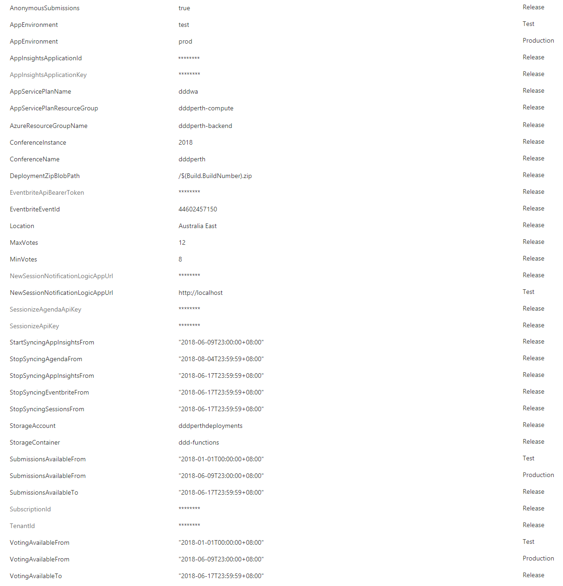

# DDD Backend

This project contains backend functionality to run the DDD conferences, including:

* Syncing data from [Sessionize](https://sessionize.com/) to Azure Table Storage (tenanted by conference year) for submitted sessions (and submitters) and separate to that, selected sessions (and presenters)
* APIs that return submission and session (agenda) information during allowed times
* APIs to facilitate voting by the community against (optionally anonymous) submitted sessions (notes stored to Azure Table Storage tenanted by conference year) including various mechanisms to detect fraud
* Syncing Tito order IDs and Azure App Insights voting user IDs to assist with voting fraud detection and validation
* API to return analysed voting information
* Ability to trigger an Azure Logic App when a new session is detected from Sessionize (which can then be used to create Microsoft Teams / Slack notifications for visibility to the organising committee and/or to trigger moderation actions)
* Tito webhook to take order notifications, de-duplicate them and place them in queue storage so they can be picked up by a Logic App (or similar) to do things like create Microsoft Teams / Slack notifications for visibility to the organising committee
* Getting feedback information and prize draw names

# Structure

* `DDD.Core`: Cross-cutting logic and core domain model
* `DDD.Functions`: Azure Functions project that contains:
    * `AppInsightsSync`: C# Azure Function that syncs app insights user IDs to Azure Table Storage for users that submitted a vote
    * `TitoNotification`: Node.js Azure Function that exposes a web hook URL that can be added to Tito (via Account Settings > Webhooks) for the `order.placed` action that will then de-duplicate webhook events and push them to queue storage for further processing (e.g. via a Logic App)
	* `TitoSync`: C# Azure Function that syncs Tito order IDs to Azure Table Storage for a configured event
	* `GetAgenda`: C# Azure Function that returns sessions and presenters that have been approved for agenda
	* `GetSubmissions`: C# Azure Function that returns submissions and submitters for use with either voting or showing submitted sessions
	* `GetVotes`: C# Azure Function that returns analysed vote information; can be piped into Microsoft Power BI or similar for further processing and visualisation
    * `NewSessionNotification`: C# Azure Function that responds to new submissions in Azure Table Storage and then calls a Logic App Web Hook URL (from config) with the session and presenter information (marking that session as notified to avoid duplicate notifications)
	* `SessionizeReadModelSync`: C# Azure Function triggered by a cron schedule defined in config that performs a sync from Sessionize to Azure Table Storage for submissions
	* `SessionizeAgendaSync`: C# Azure Function triggered by a cron schedule defined in config that performs a sync from Sessionize to Azure Table Storage for approved sessions
	* `SubmitVote`: : C# Azure Function that allows a vote for submissions to be submitted, where it is validated and persisted to Azure Table Storage
* `DDD.Sessionize`: Syncing logic to sync data from sessionize to Azure Table Storage
* `DDD.Sessionize.Tests`: Unit tests for the Sessionize Syncing code
* `infrastructure`: Azure ARM deployment scripts to provision the backend environment
    * `Deploy-Local.ps1`: Run locally to debug or develop the scripts using your user context in Azure
    * `Deploy.ps1`: Main deployment script that you need to call from CD pipeline
    * `azuredeploy.json`: Azure ARM template
* `.vsts-ci.yml`: VSTS Continuous Integration definition for this project

# Infrastructure Prerequisites

The backend application depends on programatic access to the [Frontend Website's](https://github.com/dddwa/dddperth-website) Application Insights to pull and store information on voting behaviour.

To supply this access, create an API key with `Read telemetry` permissions within the frontend website's Application Insights instance in the Azure Portal, and enter the Application ID and Key presented into the `AppInsightsApplicationId` and `AppInsightsApplicationKey` parameters.

# Setting up Continuous Delivery in VSTS

VSTS doesn't yet support .yml files for Continuous Delivery (Release) so the steps to set it up are:

* Install [SAS Token VSTS extension](https://marketplace.visualstudio.com/items?itemName=pascalnaber.PascalNaber-Xpirit-CreateSasToken)
    * todo: Just add it to Deploy.ps1
* Create the release definition triggered by the CI build
* Add a task for the SAS token generation for the storage account you persisted deployments to set the output variables to `DeploymentZipUri` and `DeploymentZipToken` respectively, recommend setting the timeout to a big number so it's always available (e.g. `1000000`), permission should just be `r`
* Add an Azure PowerShell task against your subscription and:
    * `$(System.DefaultWorkingDirectory)/{CI build name}/infrastructure/Deploy.ps1` as the script file path
    * `` as the script arguments
* Add variables, e.g.:
    
* Profit!

# New Session Notification Logic App

The `NewSessionNotificationLogicAppUrl` value is gotten by creating a logic app and copying the webhook URL from it. The logic app would roughly have:

* `When a HTTP request is received` trigger with json schema of:

    ```json
    {
        "properties": {
            "Presenters": {
                "items": {
                    "properties": {
                        "Bio": {
                            "type": "string"
                        },
                        "ExternalId": {
                            "type": "string"
                        },
                        "Id": {
                            "type": "string"
                        },
                        "Name": {
                            "type": "string"
                        },
                        "ProfilePhotoUrl": {
                            "type": "string"
                        },
                        "Tagline": {
                            "type": "string"
                        },
                        "TwitterHandle": {
                            "type": "string"
                        },
                        "WebsiteUrl": {
                            "type": "string"
                        }
                    },
                    "required": [
                        "Id",
                        "ExternalId",
                        "Name",
                        "Tagline",
                        "Bio",
                        "ProfilePhotoUrl",
                        "WebsiteUrl",
                        "TwitterHandle"
                    ],
                    "type": "object"
                },
                "type": "array"
            },
            "Session": {
                "properties": {
                    "Abstract": {
                        "type": "string"
                    },
                    "CreatedDate": {
                        "type": "string"
                    },
                    "ExternalId": {
                        "type": "string"
                    },
                    "Format": {
                        "type": "number"
                    },
                    "Id": {
                        "type": "string"
                    },
                    "Level": {},
                    "MobilePhoneContact": {},
                    "PresenterIds": {
                        "items": {
                            "type": "string"
                        },
                        "type": "array"
                    },
                    "Tags": {
                        "type": "array"
                    },
                    "Title": {
                        "type": "string"
                    }
                },
                "type": "object"
            }
        },
        "type": "object"
    }
    ```
* `For each` action against `Presenters` with a nested `Compose` action against `Name`
* `Post message` action (for Teams/Slack) with something like `@{join(actionOutputs('Compose'), ', ')} submitted a talk '@{triggerBody()?['Session']['Title']}' as @{triggerBody()?['Session']['Format']} / @{triggerBody()?['Session']['Level']} with tags @{join(triggerBody()?['Session']['Tags'], ', ')}.`
* `Send an email` action (for O365/GMail/Outlook.com depending on what you have) that sends an email if the previous step failed (via `Configure run after`)

# Tito notification logic app

The logic app would roughly have:

* `When there are messages in a queue` trigger to the `attendees` queue of the `{conferencename}functions{environment}` storage account
* `Post message` action (for Teams/Slack) with something like `@{json(trigger().outputs.body.MessageText).name} is attending @{json(trigger().outputs.body.MessageText).event} as @{json(trigger().outputs.body.MessageText).ticketClass} (orderid: @{json(trigger().outputs.body.MessageText).orderId}). @{json(trigger().outputs.body.MessageText).qtySold}/@{json(trigger().outputs.body.MessageText).totalQty} @{json(trigger().outputs.body.MessageText).ticketClass} tickets taken.`
* `Delete message` action for the `attendees` queue with the Message ID and Pop Receipt from the trigger
